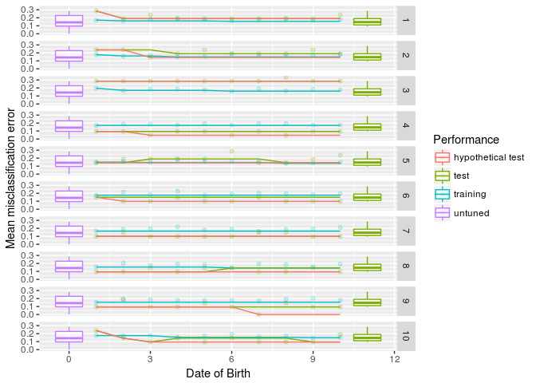
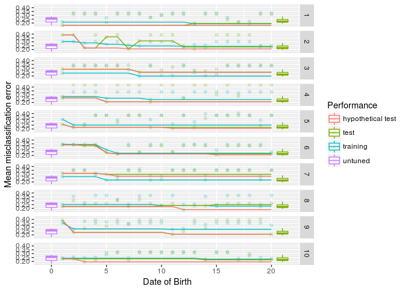

mlrOverfit
================
Jakob Richter

Easy analysis of overfitting effects based on [mlr](https://github.com/mlr-org/mlr/#-machine-learning-in-r).

Demo
----

### Short

``` r
library(mlrOverfit)

par.set = makeParamSet(
  makeIntegerParam(id = "mtry",  upper = 4, lower = 1),
  makeIntegerParam(id = "min.node.size",  upper = 10, lower = 1)
)
oa = generateOverfitAnalysis(task = sonar.task, learner = "classif.ranger", par.set = par.set)
plot(oa)
```



### Long

``` r
library(mlrOverfit)

task = pid.task
learner = makeLearner("classif.ksvm")
par.set = makeParamSet(
  makeNumericParam(id = "C",  upper = 10, lower = -5, trafo = function(x) 2^x),
  makeNumericParam(id = "sigma",  upper = 15, lower = -15, trafo = function(x) 2^x)
)
tune.control = makeTuneControlRandom(maxit = 20)
learner.tuned = makeTuneWrapper(learner = learner, resampling = hout, par.set = par.set, control = tune.control)
ro = resampleOverfit(learner = learner.tuned, task = task, resampling = cv10)

outer.errors = calcOuterPerformances(ro)
outer.errors = simulateOuterPerformance(outer.errors)
plot(outer.errors, ro)
```


