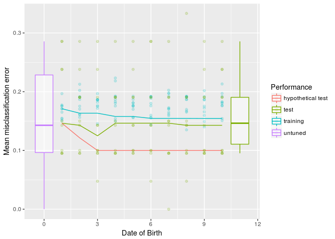
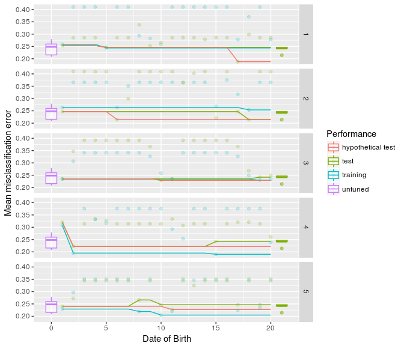

mlrOverfit
================
Jakob Richter

mlrOverfit
==========

[](https://travis-ci.org/jakob-r/mlrOverfit) [](https://coveralls.io/github/jakob-r/mlrOverfit?branch=master)

Easy analysis of over-fitting effects based on [mlr](https://github.com/mlr-org/mlr/#-machine-learning-in-r).

Motivation
----------

In a tiny study I noticed that the tuning of hyper-parameters of machine learning methods often did not led to much better results then the default settings. This is often the case for fairly small datasets where the training data does not totally represent the true data. To study those effects I wrote this tiny package. Hopefully it can help you as well. Feedback is appreciated!

Demo
----

### Short

``` r
library(mlrOverfit)

par.set = makeParamSet(
  makeIntegerParam(id = "mtry",  upper = 4, lower = 1),
  makeIntegerParam(id = "min.node.size",  upper = 10, lower = 1)
)
oa = generateOverfitAnalysis(task = sonar.task, learner = "classif.ranger", par.set = par.set)
plot(oa)
```



-   **untuned** is the performance the learner gives with the outer resampling without setting any hyper-parameters. This can also mean that heuristics are triggered inside of the learner that set the hyper-parameters.
-   **hypothetical test** The best performance we have observed on the outer test set. This is something we typically don't and shouldn't know while tuning.
-   **test** The performance on the outer test set, that we would have at this point using the hyper-parameters that led to the best performance on the inner resampling. If this curve goes up it indicates **overfitting**.
-   **training** The best performance observed on the inner resampling so far.

### Long

``` r
library(mlrOverfit)

task = pid.task
learner = makeLearner("classif.ksvm")
par.set = makeParamSet(
  makeNumericParam(id = "C",  upper = 10, lower = -5, trafo = function(x) 2^x),
  makeNumericParam(id = "sigma",  upper = 15, lower = -15, trafo = function(x) 2^x)
)
tune.control = makeTuneControlRandom(maxit = 20)
learner.tuned = makeTuneWrapper(learner = learner, resampling = hout, par.set = par.set, control = tune.control)
ro = resampleOverfit(learner.tuned = learner.tuned, task = task, resampling = cv5)

outer.errors = calcOuterPerformances(ro)
outer.errors = simulateOuterPerformance(outer.errors)
gg = plot(outer.errors, ro)
gg + facet_grid(iter~.)
```

 This time we plotted the performance without aggregation so you can see what is going on.
